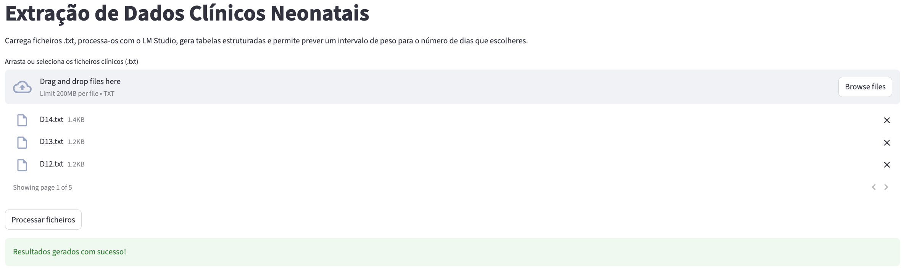
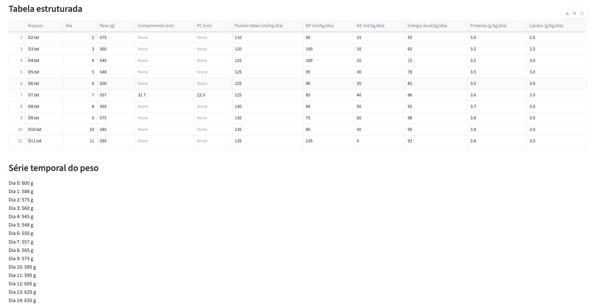
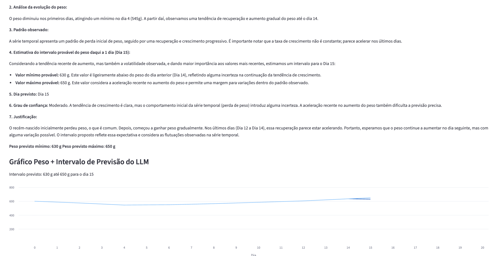

# llm-neonatal-analysis

Projeto de licenciatura focado na utilização de Large Language Models na análise longitudinal de dados neonatais. 
Projeto desenvolvido no âmbito da Licenciatura em Engenharia Biomédica no Instituto Superior de Engenharia de Coimbra (ISEC), em colaboração com o RCM2+ e a ULS Coimbra.

# Descrição

Este projeto explora a utilização de Large Language Models (LLMs) na análise longitudinal de dados neonatais e na previsão temporal da evolução do peso em recém-nascidos.

O sistema desenvolvido permite:
- extração de variáveis clínicas a partir de texto livre;
- estruturação temporal dos dados;
- previsão da evolução ponderal;
- visualização gráfica dos resultados.

# Tecnologias utilizadas

- Python
- Streamlit
- LM Studio
- Gemma 3 12B IT

# Estrutura do projeto

```text
app/       -> aplicação Streamlit
data/      -> datasets sintéticos
figures/   -> gráficos e imagens
prompts/   -> prompts utilizados
```

# Objetivo

Explorar a utilização de Large Language Models (LLMs) na análise longitudinal de dados clínicos neonatais e na previsão temporal da evolução do peso em recém-nascidos.


## Interface da aplicação



## Estruturação temporal dos dados



## Exemplo de previsão temporal



## Como executar

Instalar dependências:

```bash
pip install -r requirements.txt
```

Executar a aplicação:

```bash
streamlit run streamlit_app.py
```
